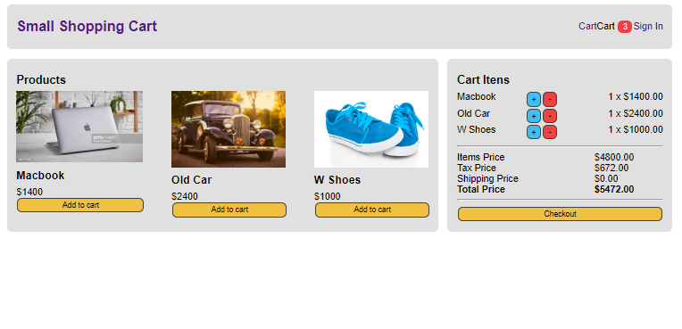

# 🛒 Shopping Cart E-commerce 💻🚗👟



## 💡 **Description:**

Welcome! This project is a small e-commerce application where you can find a variety of products like cars, MacBooks, and shoes. The main goal of this project was to practice implementing basic shopping cart functionalities such as adding and removing items, calculating totals, and managing the cart's state.

Additionally, this project served as my first introduction to creating a React application, driven by market demands for React skills. It was a great opportunity to enhance my understanding of frontend development.

The project was built following a tutorial by Professor Basir from the "Coding with Basir" channel. You can view the video that guided this project here: [React Shopping Cart Tutorial](https://www.youtube.com/watch?v=KK0B8AETwew).

## 🎯 **Technologies Used:**

- **React.js:** For building the user interface.
- **React Scripts:** To manage the project build and testing.
- **React Testing Library:** For unit testing the application.

## 📂 **How to Run the Project:**

To run this project locally, follow these steps:

1. Clone the repository:

   ```bash
   git clone https://github.com/LadyJessie19/ShoppingEcommerce.git
   ```

2. Navigate to the project directory:

   ```bash
   cd shopping-cart
   ```

3. Install the dependencies:

   ```bash
   npm install
   ```

4. Start the development server:
   ```bash
   npm start
   ```

## 🤝 **Contributions:**

If you have suggestions or improvements for this project, feel free to open a pull request. Contributions are always welcome!

## 🙋‍♀️ **Author:**


[Jessie M. Bentes](https://github.com/LadyJessie19)


Hope you find this project useful and enjoy exploring the functionalities! 🚀
